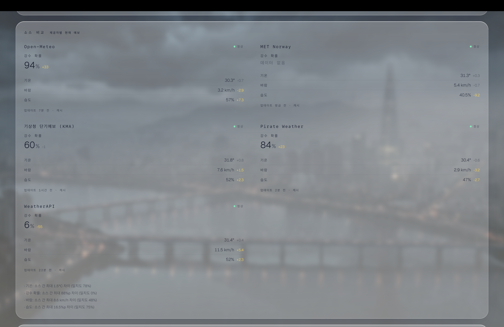

# SeoulSky


> **서울의 하늘을 대시보드가 아니라 한 편의 영화처럼 보여주는 실시간 웹 경험.** API 키 없이 켜지고, 데이터 출처 하나가 죽어도 장면은 절대 끊기지 않는다.

**▶ 라이브 데모 — [seoulsky.vercel.app/sky](https://seoulsky.vercel.app/sky)**

단일 라우트 `/sky`  ·  시간·날씨 기준은 항상 `Asia/Seoul`  ·  데스크탑은 `D` 키, 모바일은 화면 하단 **상세 날씨 보기** 버튼으로 영화 화면 ↔ 데이터 대시보드 전환


Seoul-only 날씨를 풀스크린 커스텀 셰이더로 그리고, 여러 기상 출처를 하나의 교차검증된 장면으로 융합한다. three.js도, 무거운 차트 라이브러리도 없이 — 쿼드 한 장과 폴백 체인으로 버틴다.

---

## Project handoff

### Product summary

SeoulSky is a Seoul-only cinematic live weather app. `/sky` is the primary presentation route. The product is not a general dashboard: it should answer a few Seoul-specific jobs clearly while preserving the cinematic atmosphere.

- What is Seoul like now?
- Is rain coming?
- What is the forecast?
- How trustworthy is the forecast?
- Are data sources agreeing?

### Primary user experience

The default view is the hero: Seoul, current temperature, condition, date/time, and a quiet CTA for detailed weather. The data deck opens from the CTA or the `D` key; `Esc` returns to the hero.

The data deck should read as a weather product first and a technical portfolio second:

- **지금 상태**: current wind, humidity, visibility, UV, air quality, and precipitation chance.
- **비구름 레이더**: Seoul-centered radar imagery, timeline, and play/scrub controls.
- **앞으로의 날씨**: near-term blocks and 7-day forecast.
- **예보 신뢰도**: confidence, source agreement, update time, and collapsed advanced diagnostics.

### Desktop-first priority and mobile policy

The main optimization target is desktop web, especially a MacBook Pro 14-inch style viewport.

- Primary desktop targets: `1512x982`, `1512x900`, `1440x900`.
- Stress test: `1280x720`.
- Mobile is functional-only. It should avoid obvious breakage such as overlap, unusable tap targets, bad crops, typos, and horizontal overflow. Do not spend time polishing mobile to desktop quality unless basic use is broken.

### Main route and user flow

- `app/sky/layout.tsx` mounts `WeatherExperienceShell`, which owns the persistent scene and the live `/api/sky` fetch.
- `app/sky/page.tsx` renders `SkyView`, the foreground HUD and data deck.
- The hero and data deck are fixed, cross-fading layers. They do not navigate.
- `D` toggles hero/data. `Esc` returns to hero.
- The touch CTA opens the data deck; the return button goes back to the hero.

### UI architecture overview

- `components/atmosphere/WeatherExperienceShell.tsx`: live weather state, Seoul clock, WebGL capability detection, quality settings, reduced-motion gates, view state, keyboard shortcuts, and first-load failure UI.
- `components/atmosphere/scene/SceneStage.tsx`: one persistent background scene. It composes procedural WebGL/CSS fallback, still Seoul plate, and weather FX overlay.
- `components/atmosphere/SkyView.tsx`: hero/data layers, palette wrapper, data backdrop, CTA, and return button.
- `components/atmosphere/sections/*`: `ArrivalSection`, `InstrumentsSection`, `RadarSection`, `ForecastSection`, and `GroundStationSection`.
- `app/globals.css`: `.sky-*` visual system, fixed viewport utilities, hero/data layer behavior, scene plate framing, and glass panel tokens.

### Weather data/API overview

- `/api/sky` is the lightweight public scene snapshot and the hot path for `/sky`.
- `/api/weather` is the heavier intelligence endpoint used by Ground Station for source comparison and confidence.
- `hooks/useLiveSeoulWeather.ts` fetches `/api/sky`, refreshes periodically, refreshes on resume/focus when stale, de-dupes concurrent requests, and preserves last-good data.
- Open-Meteo is the keyless baseline. KMA, AirKorea, RainViewer, MET Norway, Pirate Weather, and WeatherAPI are optional or role-specific depending on the route and configured keys.
- Do not casually change API response contracts. UI sections and last-good-data behavior rely on stable shapes in `lib/types.ts`.

### Radar overview

Displayed radar imagery is separate from the RainViewer approach signal:

- KMA apihub radar pipeline: `lib/radar/*` and `app/api/radar/*`.
- Frame metadata: `/api/radar/frames`.
- Rendered frames: `/api/radar/frame?t=...`.
- `RadarSection` owns client playback, scrubber state, loading/empty UI, and map presentation.

Do not change the radar server pipeline, frame parsing, or provider behavior for UI polish work.

### Reliability/confidence system overview

Reliability has two jobs: runtime precipitation weighting for `/api/sky`, and user-facing confidence diagnostics in Ground Station.

- `lib/reliability/runtimeWeights.ts`: gates learned precipitation weights.
- `lib/reliability/runtimeWeightsSource.ts`: cached runtime reader for `/api/sky`.
- `lib/reliability/weightsStore.ts`: narrow live-runtime reader for `data/reliability/source-weights.json`.
- `lib/reliability/store.ts`: broader batch persistence for JSONL logs and learned weights.
- `components/ConfidencePanel.tsx` and `components/ProviderComparison.tsx`: confidence and source agreement UI.

The Turbopack/NFT trace warning was fixed by narrowing the live runtime import graph: `/api/sky` now reaches the concrete weights reader through `runtimeWeightsSource -> weightsStore`, instead of importing the broad batch `store.ts` module. This keeps the route trace scoped and avoids tracing project-root files such as `next.config.ts`.

### Key components and responsibilities

- `WeatherExperienceShell`: app shell, live data orchestration, view mode, keyboard handling, and scene lifecycle gates.
- `SceneStage`: persistent full-viewport scene, fallback chain, still plate, and weather FX overlay.
- `SkyView`: foreground hero/data layers and user navigation affordances.
- `SectionParts`: shared section shell and heading rhythm.
- `RadarSection`: KMA radar map, timeline, controls, and radar loading/empty states.
- `ForecastSection`: near-term forecast blocks and 7-day cards.
- `GroundStationSection`: confidence-first summary, warnings, refresh, and advanced diagnostics disclosure.
- `useLiveSeoulWeather`: client fetch/refresh/last-good behavior for `/api/sky`.
- `skyFusion` and provider modules: server-side weather normalization, fusion, and graceful degradation.

### Recent completed UX improvements

- Clarified the hero CTA and Korean-first section labels.
- Improved Radar and Forecast fit on laptop and `1280x720` viewports.
- Added intentional radar loading/empty states and first-load weather failure UI.
- Simplified Ground Station into a confidence-first default view with advanced diagnostics collapsed.
- Fixed mobile hero framing enough for functional mobile support.
- Polished desktop data deck width/rhythm for MacBook-style viewports.
- Removed the Turbopack/NFT runtime tracing warning by narrowing reliability weights imports.

### Known limitations

- Seoul-only by design.
- Mobile is secondary and functional-only.
- Some official providers require optional keys and may degrade to keyless sources.
- Radar frames can take several seconds depending on server rendering and cache state.
- The browser cannot draw behind mobile Safari or in-app browser chrome; mobile viewport work only fills the app's visible viewport.
- Advanced diagnostics are useful, but should not be the default user-facing story.

### Things not to change casually

- `/api/sky` and `/api/weather` response contracts.
- Provider fusion rules in `lib/skyFusion.ts`.
- Weather provider semantics and optional-key degradation.
- KMA radar pipeline and frame API behavior.
- Environment variable behavior.
- WebGL render loop and scene pause behavior.
- Last-good-data behavior in `useLiveSeoulWeather`.
- Keyboard shortcuts (`D`, `Esc`) and the single hero/data view state.
- The `.sky-*` visual system as a broad redesign.

### How to run locally

```bash
npm run dev
```

Open `http://localhost:3000/sky`. No API keys are required for basic operation. Optional official data sources can be configured with `.env.local`.

Development visual override:

```text
/sky?cond=rain&hour=19
```

### How to verify before deployment

```bash
npm run lint
npx tsc --noEmit
git diff --check
npm run build
```

Manual QA:

- `/sky` at `1512x982`, `1512x900`, `1440x900`, and `1280x720`.
- One mobile smoke viewport around `390x844`.
- Hero loads, weather data appears, CTA opens data view.
- `D` opens data view; `Esc` returns to hero.
- Radar map/timeline remain visible and usable.
- Forecast remains readable.
- Ground Station default view remains confidence-first.
- Advanced diagnostics expand/collapse.
- No horizontal overflow.
- Browser console has no errors.
- `/api/sky` returns valid JSON with `current`, `hourly`, `daily`, and `sources`.

If `npm run build` fails only because Google Fonts cannot be fetched in a restricted sandbox, rerun in an environment with network access. Do not ignore Turbopack/NFT trace warnings; the known runtime tracing warning should remain gone.

### Future improvement ideas

- Split this handoff back into a tracked docs file if `docs/` stops ignoring new files.
- Add route/API smoke tests for `/api/sky` shape and last-good behavior.
- Add visual regression screenshots for the primary desktop viewports.
- Improve radar cache observability without exposing internals to normal users.
- Consider a local-font strategy if builds need to run fully offline.
- Continue refining provider confidence copy while keeping diagnostics behind progressive disclosure.

---

## 왜 이렇게 만들었나

- **raw WebGL 직접 렌더링** — 풀스크린 커스텀 셰이더를 three.js 없이 구현. 쿼드 하나면 되는 화면에 씬 그래프와 reconciler는 순수 오버헤드라 걷어냄.
- **애니메이션 루프에서 React 제거** — 매 프레임 도는 작업이 React 상태를 절대 건드리지 않음. 컨텍스트 3분할(`Field` · `Clock` · `View`)로 리렌더 입자도를 제어해 초 단위 시계가 장면을 다시 그리지 않음.
- **멀티 소스 융합 + graceful degradation** — Open-Meteo 베이스라인 위에 KMA · MET Norway · Pirate Weather · WeatherAPI를 키 선택적으로 쌓음. 출처가 실패하면 만료값을 조용히 유지하고 데이터를 지어내지 않음.
- **장면 API / 분석 API 분리** — `/api/sky`는 빠른 융합 스냅샷(씬 hot path), `/api/weather`는 5-제공자 교차검증(Ground Station 전용). 분석 호출이 렌더링을 막지 않음.
- **절대 비지 않는 폴백 체인** — `raw WebGL → pure-CSS → still plate → live FX overlay`. 어느 단계가 비어도 아래가 받쳐줘서 404 plate조차 씬을 깨지 않음.
- **AI를 오프라인 파이프라인에 가둠** — 랜드마크 still plate는 Higgsfield로 오프라인 생성, `landmark × condition × anchor` 매니페스트로 색인. 런타임엔 조회만 — 생성 지연·비용·키 노출 없음.

---

## 화면

데이터 덱은 5개 출처를 실시간으로 교차검증해 **일치도**를 보여준다 — 단일 예보의 거짓 확신 대신, 출처들이 갈릴 때 그 사실을 그대로 드러낸다.

| 소스 간 교차검증 | 제공자별 상세 비교 |
|---|---|
|  |  |
| 강수 예보가 출처마다 크게 갈리면 **"상충"**으로 표시 | 강수확률이 6% ~ 94%로 벌어진 실제 순간 |

---

## 기술 스택

| | |
|---|---|
| 프레임워크 | **Next.js 16** App Router · **React 19** · **TypeScript 5** strict |
| 스타일 | **Tailwind v4** config-less · 비주얼 시스템은 `globals.css`의 `.sky-*` |
| 배경 | **raw WebGL** 단일 쿼드 커스텀 셰이더 (three.js 없음) |
| 애니메이션 | **framer-motion** 스크롤 리빌 · `useInView` 지연 로드 |
| 데이터 | Open-Meteo + RainViewer (키 없이 동작) · 공식 출처는 선택적 보강 |
| AI 애셋 | **Higgsfield** 오프라인 빌드 파이프라인 전용 |

---

## 실행

```bash
npm run dev                 # http://localhost:3000/sky  (환경변수 불필요)
npm run build && npm start
npx tsc --noEmit            # 타입 체크
npm test                    # 158 tests · Node 22+
```

선택적 출처: `cp .env.example .env.local`  ·  개발용 오버라이드: `/sky?cond=<조건>&hour=<0–23>`

<sub>비공식 개인 프로젝트</sub>
