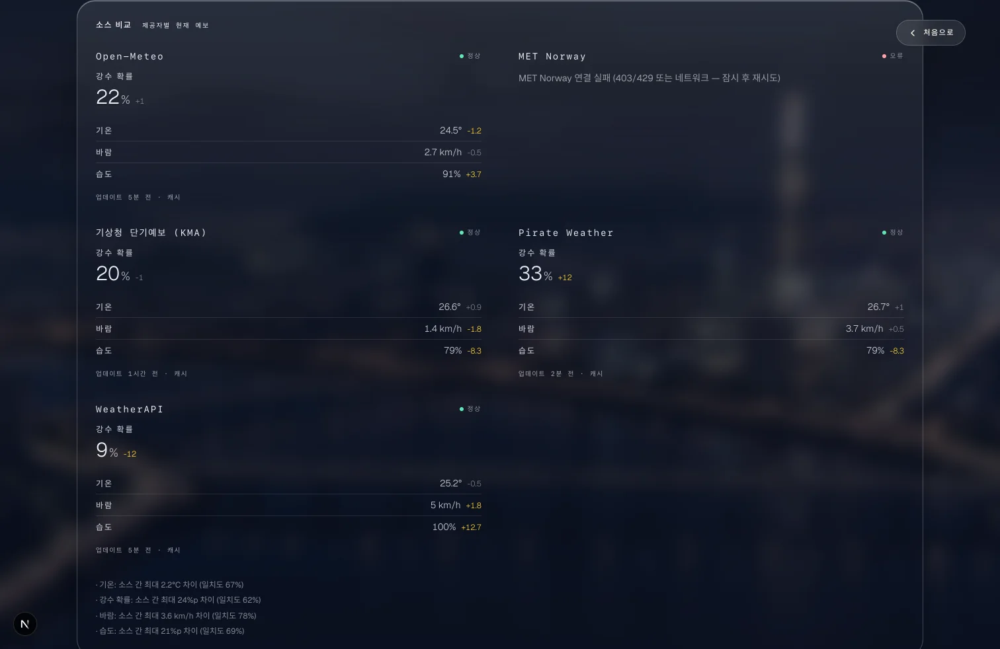
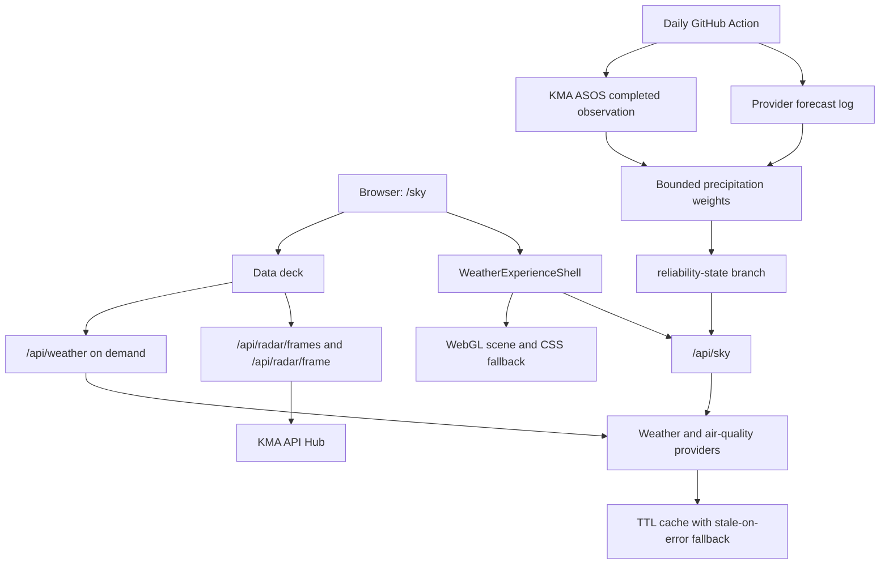

# SeoulSky

[](https://nextjs.org/)
[](https://react.dev/)
[](https://www.typescriptlang.org/)
[](https://github.com/mhju0/seoulsky/actions/workflows/precip-reliability.yml)

<p align="center">
  
</p>

SeoulSky is a Seoul-only weather experience that pairs a cinematic live scene with the practical details needed to plan the day: current conditions, KMA radar, hourly and seven-day forecasts, and transparent forecast confidence. Its adaptive precipitation ensemble verifies completed provider forecasts against KMA observations and gradually learns how much influence to give each source. It stays useful when optional providers or the learning state are unavailable.

**Live demo:** [seoulsky.vercel.app/sky](https://seoulsky.vercel.app/sky)

## What it solves

Weather apps often make a user choose between an atmospheric overview and a dense data dashboard. SeoulSky keeps both in one focused flow:

- A persistent Seoul scene provides the immediate sense of current conditions.
- The data deck answers whether rain is approaching, what the forecast shows, and how much providers agree.
- Advanced diagnostics separate **today's provider agreement** from **historical precipitation skill**, including the exact weights used for the current forecast.
- Open-Meteo provides a keyless baseline; optional KMA, AirKorea, MET Norway, Pirate Weather, and WeatherAPI sources enrich the result without becoming a single point of failure.

The primary route is `/sky`. Press `D` on desktop, or use the detail control on mobile, to open the data deck; press `Esc` to return to the scene.

## Screenshots

| Current conditions | Rain radar |
| --- | --- |
|  |  |
| **Forecast** | **Forecast confidence** |
|  |  |

The confidence deck expands into the precipitation-learning state and a full source comparison. It shows the evidence depth, safety-gate mode, current effective weights, stored learned profile, and every provider's current reading side by side.

<p align="center">
  
</p>

## Learns from completed precipitation forecasts

Every day at approximately 06:10 KST, the [`precip-reliability`](.github/workflows/precip-reliability.yml) GitHub Action runs a bounded online-learning cycle for Seoul precipitation:

1. Log tomorrow's precipitation forecast from every available provider.
2. Fetch yesterday's completed KMA ASOS daily precipitation observation for Seoul station 108.
3. Score informative provider forecasts against that independent observation.
4. Update bounded multiplicative weights and persist the append-only history on the [`reliability-state`](https://github.com/mhju0/seoulsky/tree/reliability-state/data/reliability) branch.

The web runtime reads and validates that state before blending precipitation forecasts. It starts with equal weights, gradually mixes in learned weights as evidence accumulates, and returns to equal weighting when the state is missing, stale, malformed, or explicitly disabled. Only providers that answer the current request participate, and their effective weights are renormalized rather than treating unavailable data as zero.

This is precipitation-only forecast verification, not a claim that SeoulSky retrains a weather model or is proven more accurate than its sources. Correct-dry days and missing observations do not manufacture evidence. The advanced diagnostics make the current mode, completed-date count, scored provider forecasts, observation freshness, and exact effective versus stored weights visible. See [`lib/reliability/README.md`](lib/reliability/README.md) for scoring, persistence, recovery, and runtime-gate details.

## Engineering choices

- **Adaptive precipitation ensemble:** completed forecasts are scored against KMA ASOS observations and converted into bounded, safely gated provider weights.
- **Raw WebGL with a CSS fallback:** the background uses a small custom shader rather than a scene graph, while a fallback preserves the experience when WebGL is unavailable.
- **React stays outside the animation loop:** scene updates use refs and browser APIs, avoiding per-frame React renders.
- **Fast and detailed APIs are separate:** `/api/sky` serves the live scene; `/api/weather` supplies deferred provider comparison and confidence details.
- **Graceful data degradation:** cached last-good data and provider-specific fallbacks avoid blank states or invented certainty.
- **Server-side integrations:** provider keys, raw radar grids, and upstream requests remain off the client.

## Architecture



## Stack

| Area | Technology |
| --- | --- |
| App | Next.js 16, React 19, TypeScript |
| Styling | Tailwind CSS 4 and custom CSS |
| Rendering | Raw WebGL and CSS fallback |
| Motion | Framer Motion |
| Weather | Open-Meteo baseline with optional Korean and international providers |
| Radar | KMA API Hub frames rendered server-side |
| Reliability | Daily GitHub Actions verification, KMA ASOS ground truth, bounded multiplicative weights |

## Run locally

Requires Node.js 22 or later.

```bash
npm ci
cp .env.example .env.local # optional provider configuration
npm run dev
```

Open [http://localhost:3000/sky](http://localhost:3000/sky).

No API key is required for the basic experience. Optional provider configuration is documented in [`.env.example`](.env.example), and source contracts and attribution live in [docs/weather-sources.md](docs/weather-sources.md).

The scheduled learning job requires a GitHub Actions `KMA_OBSERVATION_API_KEY` secret subscribed to the KMA ASOS daily service. Without it, forecasts continue to be logged but completed days are not scored.

## Verification

```bash
npm run lint
npx tsc --noEmit
npm test
npm run build
```

For a manual check, verify `/sky` at desktop and mobile widths, open the data deck, and confirm the radar, forecast, and confidence sections remain usable.

## Limits

- Seoul-only and desktop-first by design.
- Optional providers may be unavailable without interrupting the baseline experience.
- Radar availability depends on the configured KMA service and server execution time.
- Learned weights cover Seoul precipitation only. They describe historical provider skill, not certainty about today's weather.
- Evidence advances on informative completed precipitation forecasts, not simply once per calendar day.
- Weather information is not suitable for safety-critical decisions.

## License

[MIT](LICENSE)
