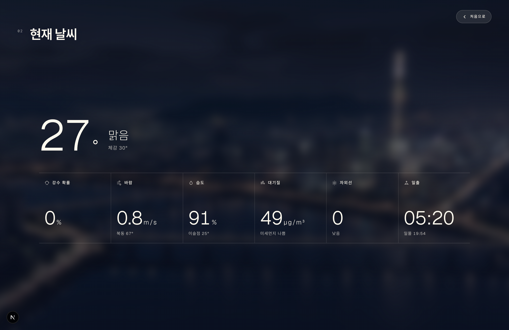
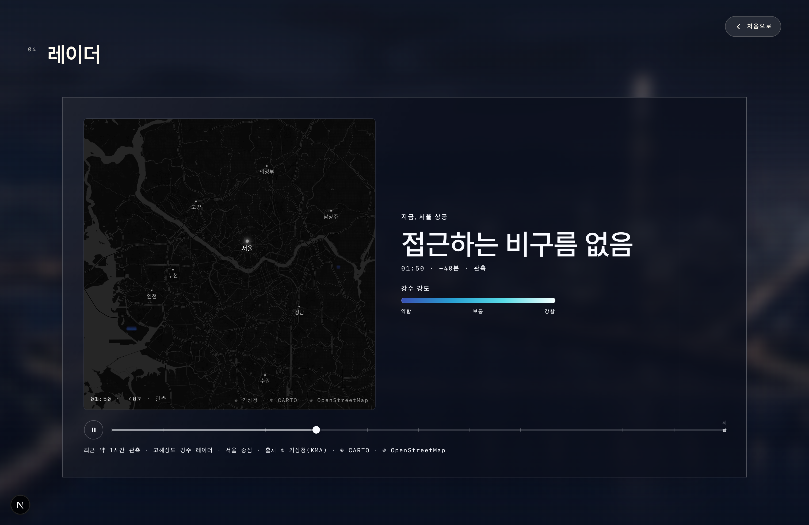
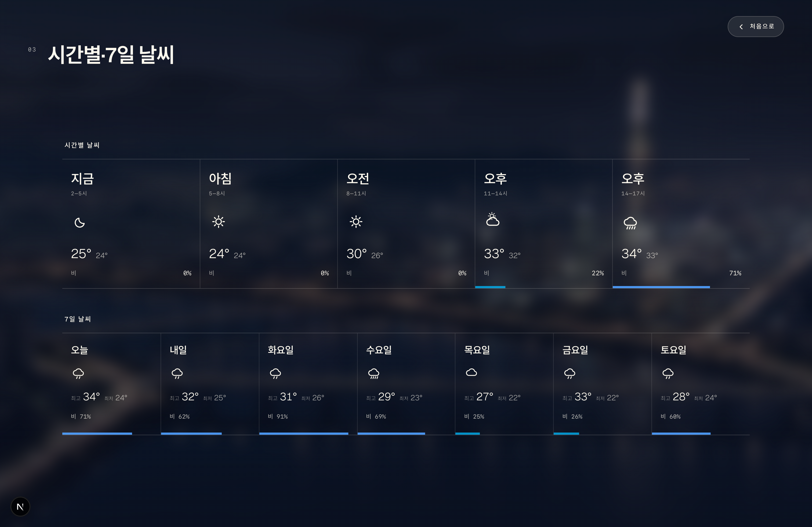
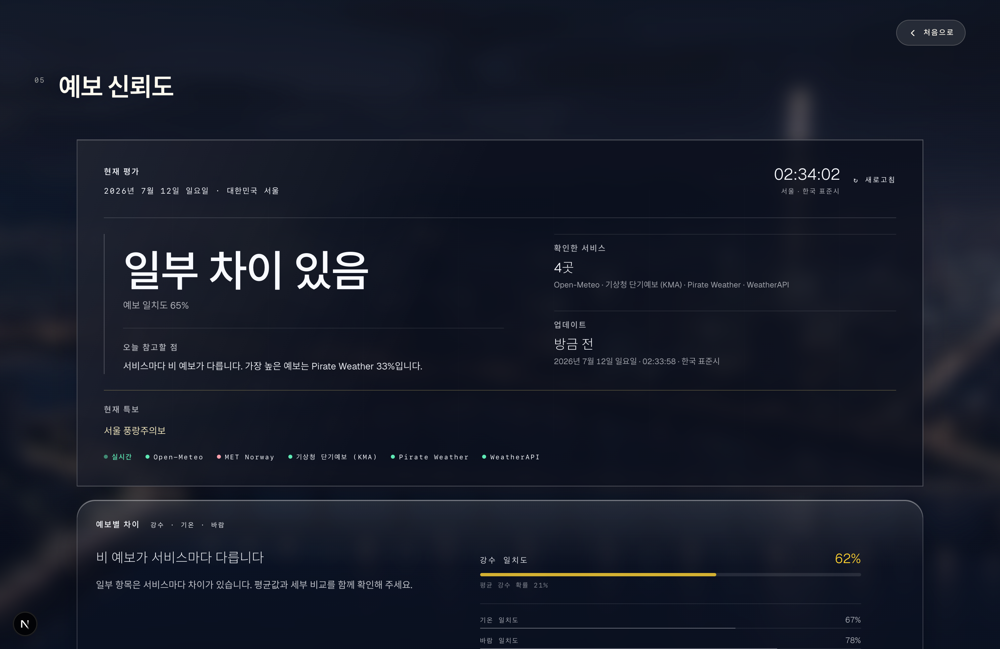
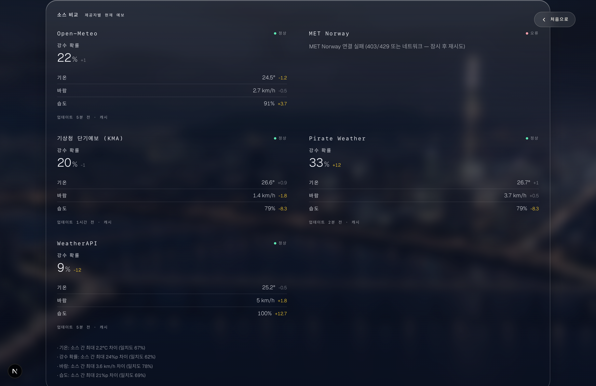

# SeoulSky


> **A real-time cinematic weather experience for Seoul, built to show the sky like a film rather than a dashboard.** SeoulSky runs without required API keys, degrades gracefully when providers fail, and keeps the scene alive even when individual data sources go down.

**Live demo: [seoulsky.vercel.app/sky](https://seoulsky.vercel.app/sky)**

Primary route: `/sky`<br>
Timezone and weather context: `Asia/Seoul`<br>
Controls: press `D` on desktop, or use **상세 날씨 보기** on mobile, to switch between the cinematic hero and the data deck. Press `Esc` to return to the hero.


## What It Is

SeoulSky is a Seoul-only live weather web app. It is not a generic weather dashboard with a city picker; it is a focused product experience for one city, designed around a persistent hero scene and a compact weather data deck.

The app is built to answer five practical questions:

- What is Seoul like now?
- Is rain coming?
- What is the forecast?
- How trustworthy is the forecast?
- Are sources agreeing?

The default impression is atmospheric: Seoul, current temperature, condition, date, time, and a quiet call to action. More detail is available, but the technical layer does not dominate the first view.

## Product Direction

SeoulSky is desktop-first, optimized mainly for MacBook Pro 14-inch and laptop browser viewports. The main desktop targets are `1512x982`, `1512x900`, `1440x900`, with `1280x720` used as a stress case.

Mobile is functional-only. It should avoid obvious breakage such as overlap, bad crops, unusable tap targets, typos, and horizontal overflow, but mobile is not intended to match the desktop composition.

The data deck is organized around Korean product labels with English-readable intent:

- `현재 날씨` / Current conditions: current temperature and condition, plus precipitation chance, wind, humidity, air quality, UV, and the next sunrise/sunset.
- `레이더` / Rain radar: Seoul-centered radar imagery, timeline, and play/scrub controls.
- `시간별·7일 날씨` / Forecast: time-of-day blocks and 7-day forecast.
- `예보 신뢰도` / Forecast confidence: confidence, source agreement, update time, and advanced diagnostics behind disclosure.

## Screenshots

| Hero | Current conditions |
|---|---|
|  |  |

| Radar | Forecast |
|---|---|
|  |  |

| Forecast confidence | Advanced diagnostics |
|---|---|
|  |  |

## Why It Was Built This Way

- **Raw WebGL rendering**: the full-screen background is a custom shader rendered without three.js. A single quad is enough for this scene, so a scene graph and reconciler would mostly add overhead.
- **React stays out of the animation loop**: per-frame work does not touch React state. The app splits context into `Field`, `Clock`, and `View` so the second-by-second Seoul clock does not repaint the scene.
- **Multi-source fusion with graceful degradation**: Open-Meteo provides the keyless baseline, with optional KMA, MET Norway, Pirate Weather, WeatherAPI, AirKorea, and radar sources adding signal when configured. If a provider fails, SeoulSky keeps the last good data where appropriate and does not invent certainty.
- **Scene API and analysis API are separate**: `/api/sky` is the fast fused snapshot used by the live scene. `/api/weather` is the heavier confidence and provider-comparison endpoint used by diagnostics. Analysis work should not block rendering.
- **The scene should never go blank**: the fallback chain is `raw WebGL -> pure CSS -> still plate -> live FX overlay`, so a missing or failed layer does not break the whole experience.
- **AI assets are offline-only**: landmark still plates are generated through an offline Higgsfield asset pipeline and indexed by `landmark x condition x anchor` manifests. Runtime only reads assets, avoiding generation latency, cost, and key exposure.

## Architecture

- `app/sky/layout.tsx` mounts `WeatherExperienceShell`, which owns the persistent scene and live `/api/sky` fetch.
- `app/sky/page.tsx` renders `SkyView`, the foreground hero and data deck.
- `components/atmosphere/WeatherExperienceShell.tsx` handles live weather state, Seoul clock, WebGL capability detection, quality settings, reduced-motion gates, view state, keyboard shortcuts, and first-load failure UI.
- `components/atmosphere/scene/SceneStage.tsx` composes the procedural WebGL/CSS fallback, still Seoul plate, and weather FX overlay as one persistent background scene.
- `components/atmosphere/SkyView.tsx` owns the fixed hero/data layers, palette wrapper, CTA, and return button.
- `components/atmosphere/sections/*` contains `ArrivalSection`, `InstrumentsSection`, `RadarSection`, `ForecastSection`, and `GroundStationSection`.
- `app/globals.css` contains the `.sky-*` visual system, fixed viewport utilities, hero/data layer behavior, scene plate framing, and glass panel tokens.

## Data And Reliability

`/api/sky` is the lightweight public scene snapshot and the hot path for `/sky`. `hooks/useLiveSeoulWeather.ts` refreshes it periodically, refreshes on resume/focus when stale, de-dupes concurrent requests, and preserves last-good data.

`/api/weather` powers deeper confidence and provider comparison in Ground Station. Confidence is presented as product information first and technical diagnostics second, with advanced details collapsed by default.

Displayed radar imagery is separate from the RainViewer-style approach signal:

- KMA apihub radar pipeline: `lib/radar/*` and `app/api/radar/*`.
- Frame metadata: `/api/radar/frames`.
- Rendered frames: `/api/radar/frame?t=...`.
- `RadarSection` owns playback, scrubber state, loading/empty UI, and map presentation.

Reliability has two jobs: runtime precipitation weighting for `/api/sky`, and user-facing confidence diagnostics in Ground Station. The runtime import graph is intentionally narrow so `/api/sky` reaches concrete weights through `runtimeWeightsSource -> weightsStore` instead of tracing the broader batch persistence module.

## Tech Stack

| Area | Details |
|---|---|
| Framework | **Next.js 16** App Router, **React 19**, **TypeScript 5** strict |
| Styling | **Tailwind v4** config-less setup, with the `.sky-*` visual system in `globals.css` |
| Background | **Raw WebGL** single-quad custom shader, no three.js |
| Motion | **framer-motion** for UI transitions and progressive reveals |
| Weather data | Open-Meteo keyless baseline, plus optional official/provider sources for added signal |
| Radar | KMA radar pipeline with frame metadata and rendered frame endpoints |
| AI assets | **Higgsfield** offline asset pipeline only; no runtime generation |

## Local Development

```bash
npm run dev
```

Open:

```text
http://localhost:3000/sky
```

No API keys are required for basic operation. Optional official/provider sources can be configured with `.env.local`.

Useful checks:

```bash
npm run build && npm start
npx tsc --noEmit
npm test
```

Development visual override:

```text
/sky?cond=rain&hour=19
```

## Verification

Before deployment, run:

- `npm run lint`
- `npx tsc --noEmit`
- `git diff --check`
- `npm run build`

Manual QA:

- Check `/sky` at laptop viewport sizes such as `1512x982`, `1512x900`, `1440x900`, and `1280x720`.
- Run one mobile smoke check around `390x844`.
- Confirm the hero loads, weather data appears, and the CTA opens the data view.
- Confirm `D` opens the data view and `Esc` returns to the hero.
- Confirm radar, forecast, and confidence sections remain readable and usable.
- Confirm `/api/sky` returns valid JSON with `current`, `hourly`, `daily`, and `sources`.

If `npm run build` fails only because Google Fonts cannot be fetched in a restricted sandbox, rerun in an environment with network access. Do not ignore Turbopack/NFT trace warnings; the known runtime tracing warning should remain gone.

## Known Limitations

- Seoul-only by design.
- Desktop-first by design.
- Mobile is functional-only and should mainly avoid obvious breakage.
- Optional provider keys can degrade or disappear without breaking the basic app.
- Radar can take several seconds depending on cache and server state.
- Browsers cannot draw behind mobile Safari or in-app browser chrome; the app can only fill the visible viewport.
- Advanced diagnostics exist for transparency, but should not dominate the default UX.

## Guardrails

Do not change these casually:

- `/api/sky` and `/api/weather` response contracts.
- Provider fusion rules in `lib/skyFusion.ts`.
- Weather provider semantics and optional-key degradation.
- KMA radar pipeline and frame API behavior.
- WebGL render loop and scene pause behavior.
- Last-good-data behavior in `useLiveSeoulWeather`.
- `D` / `Esc` hero-data interaction and the single hero/data view state.
- The `.sky-*` visual system as a broad redesign.

## Case Study

See [CASE_STUDY.md](CASE_STUDY.md) for a more focused product and architecture write-up.

<sub>Unofficial personal project.</sub>
