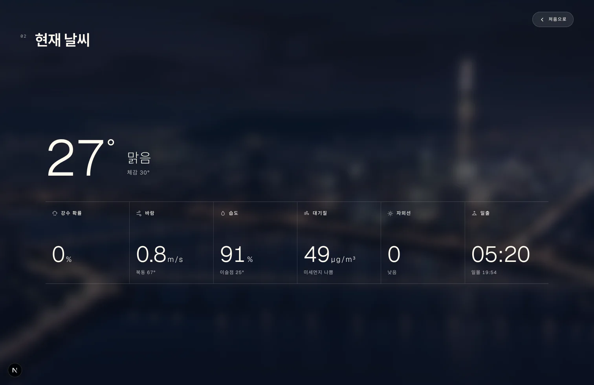
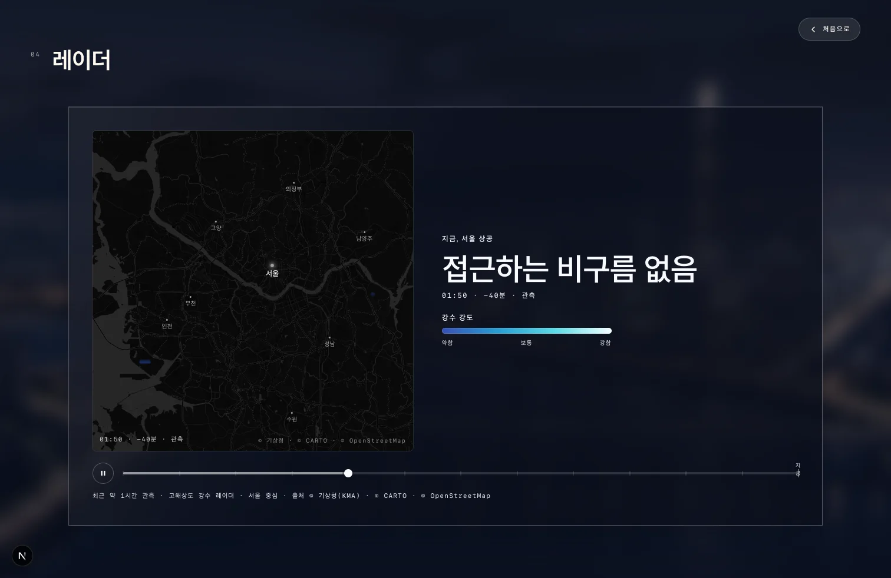
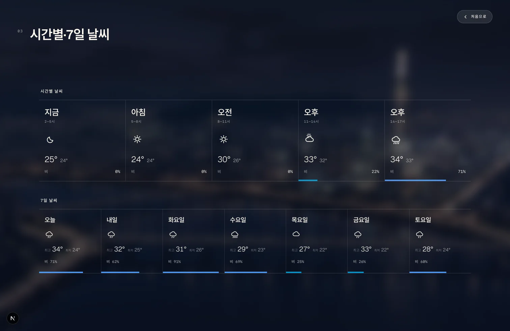
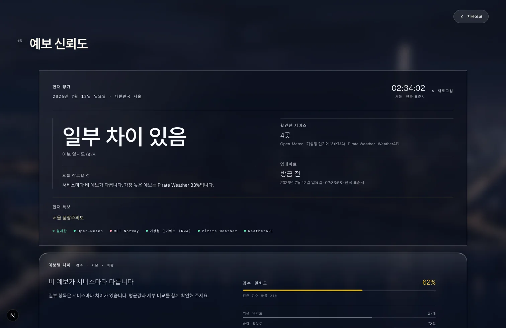

# SeoulSky

[](https://nextjs.org/)
[](https://react.dev/)
[](https://www.typescriptlang.org/)

SeoulSky is a Seoul-only weather experience that pairs a cinematic live scene with the practical details needed to plan the day: current conditions, KMA radar, hourly and seven-day forecasts, and transparent forecast confidence. It is designed around one place rather than a generic city-picker dashboard, and it stays useful when optional data providers are unavailable.

**Live demo:** [seoulsky.vercel.app/sky](https://seoulsky.vercel.app/sky)

## What it solves

Weather apps often make a user choose between an atmospheric overview and a dense data dashboard. SeoulSky keeps both in one focused flow:

- A persistent Seoul scene provides the immediate sense of current conditions.
- The data deck answers whether rain is approaching, what the forecast shows, and how much providers agree.
- Open-Meteo provides a keyless baseline; optional KMA, AirKorea, MET Norway, Pirate Weather, and WeatherAPI sources enrich the result without becoming a single point of failure.

The primary route is `/sky`. Press `D` on desktop, or use the detail control on mobile, to open the data deck; press `Esc` to return to the scene.

## Screenshots

| Current conditions | Rain radar |
| --- | --- |
|  |  |
| **Forecast** | **Forecast confidence** |
|  |  |

## Engineering choices

- **Raw WebGL with a CSS fallback:** the background uses a small custom shader rather than a scene graph, while a fallback preserves the experience when WebGL is unavailable.
- **React stays outside the animation loop:** scene updates use refs and browser APIs, avoiding per-frame React renders.
- **Fast and detailed APIs are separate:** `/api/sky` serves the live scene; `/api/weather` supplies deferred provider comparison and confidence details.
- **Graceful data degradation:** cached last-good data and provider-specific fallbacks avoid blank states or invented certainty.
- **Server-side integrations:** provider keys, raw radar grids, and upstream requests remain off the client.

## Architecture

```mermaid
flowchart TB
  Browser[Browser: /sky] --> Shell[WeatherExperienceShell]
  Shell --> SkyAPI[/api/sky]
  Shell --> Scene[WebGL scene and CSS fallback]
  Browser --> Deck[Data deck]
  Deck --> Radar[/api/radar/frames and /api/radar/frame]
  Deck --> Intelligence[/api/weather on demand]
  SkyAPI --> Providers[Weather and air-quality providers]
  Intelligence --> Providers
  Radar --> KMA[KMA API Hub]
  Providers --> Cache[TTL cache with stale-on-error fallback]
```

## Stack

| Area | Technology |
| --- | --- |
| App | Next.js 16, React 19, TypeScript |
| Styling | Tailwind CSS 4 and custom CSS |
| Rendering | Raw WebGL and CSS fallback |
| Motion | Framer Motion |
| Weather | Open-Meteo baseline with optional Korean and international providers |
| Radar | KMA API Hub frames rendered server-side |

## Run locally

Requires Node.js 22 or later.

```bash
npm ci
cp .env.example .env.local # optional provider configuration
npm run dev
```

Open [http://localhost:3000/sky](http://localhost:3000/sky).

No API key is required for the basic experience. Optional provider configuration is documented in [`.env.example`](.env.example), and source contracts and attribution live in [docs/weather-sources.md](docs/weather-sources.md).

## Verification

```bash
npm run lint
npx tsc --noEmit
npm test
npm run build
```

For a manual check, verify `/sky` at desktop and mobile widths, open the data deck, and confirm the radar, forecast, and confidence sections remain usable.

## Limits

- Seoul-only and desktop-first by design.
- Optional providers may be unavailable without interrupting the baseline experience.
- Radar availability depends on the configured KMA service and server execution time.
- Weather information is not suitable for safety-critical decisions.

## License

[MIT](LICENSE)
